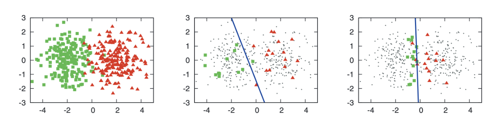
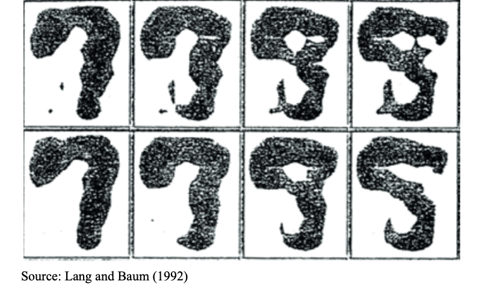

```{r setup, include=FALSE}
knitr::opts_chunk$set(echo = TRUE)
library(reticulate)
```

# 1 Motivation

## 1.1 General Motivation

Active learning allows users to save significant time and resources on data labeling. In unsupervised learning problems, learners are trained on unlabeled data (meaning, no outcome variable) for analysis and clustering. ([Settles 2009](https://minds.wisconsin.edu/bitstream/handle/1793/60660/TR1648.pdf?sequence=1&isAllowed=y)) Supervised learning requires labeled training data for classification or regression. Supervised learning tends to be more accurate than unsupervised learning, but obtaining class labels for all observations can be expensive, time-consuming, or difficult. 

Semi-supervised learning allows for a subset of the training data to be labeled, allowing for some of the accuracy benefits of supervised learning while keeping the need for costly labeling low. Active learning is a form of semi-supervised learning in which the model prompts the human user to actively label selected data points that will bring the greatest benefit for the accuracy of the model. ([Kundu 7Labs](https://www.v7labs.com/blog/active-learning-guide))


## 1.2 Example

As an example, say that you have a dataset of images of three different animals: dogs, cats, and birds. The image data is unlabeled, meaning that it did not come with labels for whether each observation (image) is a dog, cat, or bird.

**Goal**: Create a model that predicts whether each image is a dog, cat, or bird. 

There are multiple unsupervised methods that can be used in this situation, such as clustering or mixture models. Another method is to manually classify a certain amount of randomly selected images from this dataset then train the model on those images. This has drawbacks, however. 

Say that in this example, $N_{Dog}= 1000;N_{cat}=1000;N_{bird}=20$. This is not an atypical case for classifications such as disease diagnosis. Then, if only 500 observations can be labeled, the labeled set would be expected to only contain observations that are dogs or cats, with no birds.

Active learning is a “smart” version of this method. Here, active learning would choose (or in some cases, generate) images that the initial model is most uncertain about for labeling by a human user, called an oracle ([Lewis and Gale 1994](https://arxiv.org/pdf/cmp-lg/9407020.pdf)).

## 1.3 Uncertainty Sampling

```{r, echo=FALSE, fig.align='center',out.height='75%',out.width='90%'}
library(knitr)

```

The figure above (obtained from [this source](https://www.morganclaypool.com/doi/epdf/10.2200/S00429ED1V01Y201207AIM018)) shows the benefit of an active learning model compared to a regular semi-supervised classifier. Graph (a) shows points generated from 2 Gaussian distributions with =1, centered at (-2,0) and (2,0) respectively. Graph (b) shows the results of a logistic regression classifier trained on 30 randomly selected labeled observations. The blue line shows the decision boundary. Graph (c) shows a logistic regression trained with 30 actively labeled observations, chosen using uncertainty sampling. The decision boundary for the actively trained model is much closer to the actual boundary between the distributions.

It is also notable which points were chosen for query in the active learning classifier. They are much closer to the decision boundary than the randomly selected labeled points in graph (b). Therefore, active learning will choose points for query that the classifier is most uncertain about, or that will bring about the greatest increase in model accuracy or reduction in variance. There are multiple strategies for choosing these query points. Our lesson will focus on uncertainty sampling. 

# 2 Active Learning Methods

A good resource for reading about active learning literature is [this book](https://www.morganclaypool.com/doi/epdf/10.2200/S00429ED1V01Y201207AIM018) by Burr Settles. Active learning falls into multiple buckets: Pool-based, query-synthesis, and stream-based selective sampling, though the field is always changing.

## 2.1 Query Synthesis and Stream-based Active Learning

Query synthesis permits the model to request a query for any unlabeled data, or even newly synthesized queries. This allows the learner to expand the range of usable training signals. 

```{r, echo=FALSE, fig.align='center',out.height='75%',out.width='90%'}

```

The image above shows a potential drawback of query synthesis active learning. These images were generated as synthesized queries by a neural network attempting to recognize handwritten digits- several are unrecognizable even for a human. The active learning method generated images that it felt the model would be uncertain about, but in doing this, made it impossible for actual labeling by a human. This has also been observed in query synthesis models for natural language learners creating unintelligible streams of audio or text.

Stream-based selective sampling is another active learning structure. In this scenario, the model samples observations from the unlabeled set and makes a decision whether to request a label for each observation or discard it. Essentially, each observation is selected one at a time and, using some criterion, either given to the human for labeling or discarded. This allows the learner to estimate the underlying distribution(s) that generated the data. Stream-based sampling assumes that acquiring unlabeled data instances is trivial or free. 

## 2.2 Pool-based Active Learning:

We will focus on pool-based active learning, where we consider our data as split into two pools: U, the large set of unlabeled data, and L, a smaller set of labeled data. L is often initialized via randomization - a small set of observations, chosen randomly, is labeled for an initial set. 

Using some query framework (discussed in depth below), the learner requests human classification for a number of observations in U, which are then moved to L as they become labeled data points. The model learns from the newly labeled data, and uses this knowledge for the next query. This iterative process may continue for as long as necessary to reach desired model accuracy. We chose to delve deeper into this method because it is the most commonly used method and has been applied in many real world problems, including text classification and image recognition  ([DataRobot](https://www.datarobot.com/blog/active-learning-machine-learning/)).

Pool-based active learning is an intuitive method for active learning because it trains the model on a small amount of labeled data (which sometimes are randomly sampled), then finds the most uncertain observations and selects those for labeled, thus increasing the efficiency of labeling effects on the model. The other methods, while useful, use strategies that are more specific in certain situations. It was shown earlier, for example, that query synthesis strategies may not make sense in text analytics situations, where it generates unintelligible “handwritten” numbers. Stream-based methods will throw out observations that are not labeled by the oracle, which only makes sense in situations where data is widespread or easily obtainable. Also, Settles [claims](https://minds.wisconsin.edu/bitstream/handle/1793/60660/TR1648.pdf?sequence=1&isAllowed=y) that “the pool-based scenario appears to be much more common among application papers”. Thus, the discussion below is all only in reference to pool-based active learning.

## 2.3 How are the query points chosen?

There are varying methods for deciding which observations to query in the pool-based active learning approach. The most common methods are least confidence, margin, and entropy.

### 2.3.1 Least Confidence

$$x_{LC}^*=argmin_xP(y^*|X;\theta)$$

where $y^*=argmax_yP(y|X;\theta)$


The simplest method is the least confidence method. This method chooses the points with the lowest probability for their highest class. In other words, it determines for each point the response class with the highest probability (using a model with the currently labeled data). Then, after doing this for each point, it returns the point with the lowest probability ([Settles 2012](https://www.morganclaypool.com/doi/epdf/10.2200/S00429ED1V01Y201207AIM018)).

##### Pseudocode

| 1. For i in num_rows:
|      a. Calculate the posterior probability of each response class with the model using the small amount of labeled data.
|      b. Choose the class with the highest probability and return this probability
| 2. Find the minimum of these highest posterior probabilities and select for labeling by the oracle

##### Pros and Cons:

At a higher level, least confidence looks at the confidence of the most likely class. It is equivalent to the expected 0-1 loss, or the probability that the model’s hard classification is incorrect. The problem with this method is that the only posterior probability it uses is the class with the maximum posterior probability, while essentially throwing out the other probabilities for the purposes of calculation. It would classify an observation that was very uncertain between two classes (say 30% in two classes, and 40% split across the other classes) the same as an observation that was slightly confident in one class (30% and to 10% for all other classes) ([Lewis and Gale 1994](https://arxiv.org/pdf/cmp-lg/9407020.pdf)). Due to its intuitive nature and simplicity, this method will be used in the coding examples. However, in the Python package used, the user can easily specify which uncertainty measure to use.

### 2.3.2 Margin

$$x_M^*=argmin_x[P(\hat{y_1}|X;\theta)-P(\hat{y_2}|X;\theta)]$$

where $\hat{y_1}=argmax_yP(y|X;\theta)$ and $\hat{y_2}=argmax_yP(y_{-\hat{y_1}}|X;\theta)$ 

The margin method finds the difference between the two most probable predicted responses. If the model is certain about which class to choose, the difference between the predicted class and second most predicted class would be large. So this model selects the observation(s) with the smallest difference between the two most predicted classes ([Settles 2012](https://www.morganclaypool.com/doi/epdf/10.2200/S00429ED1V01Y201207AIM018)).

##### Pseudocode

| 1. For i in num_rows:
|      a. Calculate the posterior probability of each response class with the model using the small amount of labeled data available.
|      b. Calculate the margin, or the difference between the two highest posterior probabilities
| 2. Find the minimum of these margins and select point(s) for labeling with the oracle.

##### Pros and Cons

While this method does use more of the posterior probability information than least confidence, it still does not use all the information available to make decisions about which observations (unless the response is binary). Because of that, it is less useful when the response has many classes. Both least confidence and margin are uncertainty measures that are useful in classes where classification error is low. These two methods implicitly use hard classifications in that the highest class probability is crucial in their calculations ([Settles and Craven 2008](https://www.biostat.wisc.edu/~craven/papers/settles.emnlp08.pdf)). 

### 2.3.3 Entropy

$$x_E^*=argmax_x[-\sum_y P(y_i|X;\theta)logP(y_y|X;\theta)]$$

Entropy was formally introduced in the fields of thermodynamics and information theory by Claude Shannon in [this paper](https://people.math.harvard.edu/~ctm/home/text/others/shannon/entropy/entropy.pdf). It is essentially a measure of the amount of information in a certain set of data. It is a measure of uncertainty in data and is useful in this context in which active learning is attempting to identify the most uncertain observations in the model. The mathematical calculation is given in the equation above. 

##### Pros and Cons

Unlike the other methods, this method uses all of the posterior probabilities in its calculation. It is a generally better metric to use when the response variable has many classes, as the other methods will discard much of the information in the model. While least confidence can be interpreted as the expected 0-1 loss using hard classifications, entropy can be interpreted as the expected log-loss. In his all [encompassing literature review book](https://www.morganclaypool.com/doi/epdf/10.2200/S00429ED1V01Y201207AIM018), Settles explains which methods should be used in different situations, “Intuitively, entropy seems appropriate if the objective function is to minimize log-loss, while least confidence and margin are more appropriate if we aim to reduce classification error since they prefer instances that would help the model better discriminate among specific classes.”

# 3 Coding Implementation

## 3.1 Pseudocode

| 1. Obtain U = pool of unlabeled instances
| 2. Obtain L = small set of initial labeled instances
|     a. L may have been obtained with U or may be a small, randomly sampled set of U for initial labeling
| 3. For t = 1, 2, …:
|     a. Train model on L
|     b. Select x* from U based on uncertainty sampling criterion
|         i. x* may be a single observation or a set of observations
|     b. Query the oracle to label y*
|     d. Add (x*, y*) to L and remove from U
|     e. Determine if a performance threshold has been met or if marginal cost to the oracle of labeling another observation is low

## 3.2 R example using the Wine Quality Dataset

```{r, warning=FALSE, message=FALSE}
library(tidyverse)

wine <- read_csv('winequalityN.csv')
```

Here we are going to use the UCI wine quality machine learning dataset for our example in R. The wine quality dataset is a classification dataset with 6 wine quality classes we will be looking to predict. 
```{r}
ggplot(wine, aes(x = as.factor(quality), fill = as.factor(quality))) + geom_bar() + labs(title = 'Wine Quality', 
                                                              x = 'Quality',
                                                              y = 'Count') + 
 theme_minimal() + theme(legend.position = "none") 
  
```

To simplify our problem, we are going to just select wine qualities 5 and 6 so we will have a binary classification problem. We will also only use 2 predictor variables so that we can plot the decision boundaries for the two classes. 

```{r}
## Alcohol and sulphates had the highest correlation with quality so we will use those 2
wine_subset = select(wine, alcohol, sulphates, quality)
wine_subset = wine_subset[wine_subset$quality %in% c(5,6) , ]

## Make wine quality 5 a 1 and quality 6 a 0 and change the variable to be a factor
wine_subset$quality <- ifelse(wine_subset$quality == 5, 1, 0)
wine_subset <- wine_subset %>% mutate(quality = as.factor(quality))
```

We are first going to create a 'true' model which trained using all of the data. This will be our baseline comparison to use to see how our active learning model performs.
```{r}
true_model = glm(quality ~ ., data = wine_subset, family = binomial(logit))

slope = coef(true_model)[2]/(-coef(true_model)[3])
intercept = coef(true_model)[1]/(-coef(true_model)[3]) 
ggplot(wine_subset, aes(x=alcohol, y=sulphates, 
        shape=quality, color=quality)) + geom_point() + 
        geom_abline(slope=slope, intercept=intercept) +
        ggtitle("True Model: Alcohol and Sulphates on Quality") 

truth_slope = slope
truth_intercept = intercept
```


Going to create an initial test train split (80/20). 
```{r}
set.seed(1029)
size = floor(0.8 * nrow(wine_subset))
train_ind = sample(seq_len(nrow(wine_subset)), size = size)
train = wine_subset[train_ind, ]
test = wine_subset[-train_ind, ]
```

Now we want to split our training data set again into a initially labeled and unlabeled set.
```{r}
initally_labeled = sample(seq_len(nrow(train)), size = 10)
labeled = train[initally_labeled, ]
unlabeled = train[-initally_labeled, ]
```

Next we create an initial model using the 10 labeled training points
```{r, message=FALSE, warning=FALSE}
initial_model = glm(quality ~ ., data = labeled, family = binomial(logit))
```

We will now plot that initial model and compare with our true model plotted earlier. Here the solid black line will be our initial model and the purple line the true model.
```{r}
slope_init = coef(initial_model)[2]/(-coef(initial_model)[3])
intercept_init = coef(initial_model)[1]/(-coef(initial_model)[3]) 

ggplot() + geom_point(data = train, aes(x=alcohol, y=sulphates)) +
  geom_abline(slope = slope_init, intercept = intercept_init) + 
  geom_point(data = labeled,aes(x=alcohol, y=sulphates , shape=quality, color=quality)) + ggtitle("Initial Model vs True Model") +
  geom_abline(slope = truth_slope, intercept = truth_intercept, 
            linetype = "dashed", color = "purple")
```

Next we will use two functions created by Andy Wang which we found in an active learning article he wrote last October. A link to his github can be found <a href = "https://github.com/AndyWangSFU/Active_Learning_in_R/blob/main/Active_Learning_in_R_Rcode.Rmd">here</a> and the article can be found <a href = "https://towardsdatascience.com/active-learning-an-exploratory-study-of-its-application-in-statistics-and-r-65713ccdad16">here</a>. These two functions will help us to calculate the distance from the points in the training data not included in the initial set to the created regression line, which we will then take the closest points and include them in our next model iteration. 
```{r}
dist2d = function(a,b,c) {
   v1 = b - c
   v2 = a - b
   m = cbind(v1,v2)
   d = abs(det(m))/sqrt(sum(v1*v1))
   
   return(d)
}
return_two_points_in_a_line = function(slope, intercept){
  x1 = 5
  x2 = 6
  y1 = slope*x1 + intercept
  y2 = slope*x2 + intercept
  # plot(c(x1,x2), c(y1,y2), xlim = c(3,7))
  point1 = c(x1, y1)
  point2 = c(x2, y2)
  return(list(point1 = point1, point2 = point2))
}
```

Taking pieces of code found on Andy's github page, we create here a for loop that will run all through 20 iterations of our model for us. Andy added 1 point to the model each time but we chose to add 10 at a time (The 10 points with the most uncertainty) since we had significantly more data. We also chose to do only 20 iterations since that would mean close to 4% of the dataset would had to have been labeled by us manually. We didn't think anymore than that made sense since the whole point of this model would be to help us identify these unlabeled points.  
```{r, warning=FALSE}
for (iter in 1:20){
  
  two_points = return_two_points_in_a_line(slope_init, intercept_init)
  # update the distance for points to the new logistic regression line
  unlabeled$dist = NA
  for(i in 1:nrow(labeled)){
    point = c(unlabeled$alcohol[i], unlabeled$sulphates[i])
    unlabeled$dist[i] = dist2d(point, two_points$point1, two_points$point2)
  }
  
  # Query 10 new points each iteration
  query_point_index = sort(unlabeled$dist, index.return=TRUE, decreasing=FALSE) 
  query_point_index = query_point_index$ix[1:10]
  query_point = unlabeled[query_point_index, c(1,2,3)]
  
  unlabeled = unlabeled[-query_point_index,]
  labeled = rbind(labeled, query_point)
  
  # re-train a new model 
  glfit_init_add = glm(quality ~ ., data = labeled, family = binomial(logit))
  
  slope_init = coef(glfit_init_add)[2]/(-coef(glfit_init_add)[3])
  intercept_init = coef(glfit_init_add)[1]/(-coef(glfit_init_add)[3]) 
  
  curr_plot = ggplot() + 
    geom_point(data = train, aes(x=alcohol, y=sulphates)) +
    geom_abline(slope = slope_init, intercept = intercept_init) + 
    geom_point(data = labeled,aes(x=alcohol, y=sulphates, shape=quality, color=quality)) +
    geom_point(data = query_point, aes(x=alcohol, y=sulphates), 
               size = 7, shape = 23, color = "blue") +
        ggtitle(paste0("Active Learning (Uncertainty): iteration ", iter)) +
    geom_abline(slope = truth_slope, intercept = truth_intercept, linetype = "dashed", color = "purple")
  
  if(iter<=10 | iter == 20){
    ggsave(paste0("AL_process_UC_", iter, ".png"), width = 7, height = 4.33)
  }
  
  if(iter%in%c(1,2,3,4,5,10,20)){
    print(curr_plot)
  }
}
```

On each plot there is a diamond around the 10 new points added to the model that iteration. We can see how far away from the true model the regression line starts and how by iteration 20 it is very close to the true model. Next we will look at the confusion matrix to see how initial model performed on our test data and compare that to our iteration 20 model. 

```{r}
predicted_prob = predict(initial_model, test, type = "response")
predicted_classes = ifelse(predicted_prob > 0.5, 1, 0)
table(test$quality, predicted_classes, dnn = c("Obs", "Pred"))
```

Our initial model had an accuracy 64.4%. Given the context of the setup, we thought this was pretty impressive. With only 10 initial observations, we took the 2 most common wine quality classes, that happened to overlap quite significantly, and only used the 2 most correlated predictors. Next we will look at the confusion matrix for the iteration 20 model. 

```{r}
predicted_prob = predict(glfit_init_add, test, type = "response")
predicted_classes = ifelse(predicted_prob > 0.5, 1, 0)
table(test$quality, predicted_classes, dnn = c("Obs", "Pred"))
```

We have an overall accuracy of 66.1%. While this is only ~2% improvement on our initial model, we thought that this is actually a significant improvement as all of the gain here came from more accurately identifying some of the points on the boundary. The points that were far away from the decision line were very easy to classify one way or another. The two classes had a major overlap and expecting a more accurate classification with the given problem setup isn't realistic. As an indirect comparison we will now use a python package, called alipy, to perform the same active learning classification on the same wine dataset, except this time using 3 classes and all 12 predictor variables. 

```{python}
import alipy
```

## 3.2 ALiPy Python Package Example

Documentation for ALiPy can be found at [this github](https://github.com/NUAA-AL/ALiPy). This website contains an example using the iris dataset. The creators also made [this website](http://parnec.nuaa.edu.cn/huangsj/alipy/) as an aid for using the package. It contains multiple tutorials and detailed documentation. Below we run through a tutorial of using this package with the same wine dataset as above:

First you want to load in your packages and the wine dataset from sklearn. This dataset is a subset of the wine dataset from before but with 3 classes, which we will use for this example. 
```{python}
import copy
from sklearn.datasets import load_wine
from alipy import ToolBox
```

Here you want to load in the data set and use built in alipy toolbox method to split the data into test data, initially labeled training data, and unlabeled training data. We will use an initial labeled split of 5%, which will be 6 observations. Overall we will use a 70-30 train test split. 
```{python warning = FALSE, message = FALSE}
X, y = load_wine(return_X_y=True)
alibox = ToolBox(X=X, y=y, query_type='AllLabels', saving_path='.')
# Split the data using the split method
AL = alibox.split_AL(test_ratio=0.3, initial_label_rate=0.05, split_count=10)
```

Note here that when you initialize a toolbox with a dataset, the dataset variables are saved to a file in your local directory called al_settings.pkl, which you will need to delete to initialize a new toolbox with a different dataset. Next we will specify that we want to use logistic regression as our model. We will use 50 queries per round of our model. We also specify that we want to use instance uncertainty as our measure of what points to label. Some other strategies available with the package are Graph Density, Random, Query by Committee, and Expected Error Reduction. You can import your own strategy as well.  

```{python}
     # Use a Logistic Regression classifier
model = alibox.get_default_model()
     
     # The cost budget is 50 times querying
stopping_criterion = alibox.get_stopping_criterion('num_of_queries', 50)
     
     # Use instance uncertainty as our strategy
uncertainStrategy = alibox.get_query_strategy(strategy_name='QueryInstanceUncertainty')
unc_result = []
```

Here we create a loop that will run 10 times or ten rounds. In the first round the model will use the initial 6 points that are labeled as the training data. It then fits a logistic regression model and calculates accuracy on the test data. Based on the uncertainstrategy we selected above, it will then pick the points it wants us to label and we feed those into the model in addition to the initial 6 points. It then retrains the model and recalculates the accuracy and repeats the steps above. It will do this 10 times for 10 rounds. 
```{python warning = FALSE, message = FALSE, results='hide'}     
for round in range(10):
         # Get the data split of one fold experiment
    train_idx, test_idx, label_ind, unlab_ind = alibox.get_split(round)
         # Get intermediate results saver for one fold experiment
    saver = alibox.get_stateio(round)
     
         # Set initial performance point
    model.fit(X=X[label_ind.index, :], y=y[label_ind.index])
    pred = model.predict(X[test_idx, :])
    accuracy = alibox.calc_performance_metric(y_true=y[test_idx],
                                                   y_pred=pred,
                                                   performance_metric='accuracy_score')
    saver.set_initial_point(accuracy)
     
    while not stopping_criterion.is_stop():
        select_ind = uncertainStrategy.select(label_ind, unlab_ind, model=model, batch_size=1)
     
        label_ind.update(select_ind)
        unlab_ind.difference_update(select_ind)
     
             # Update model and calc performance according to the model you are using
        model.fit(X=X[label_ind.index, :], y=y[label_ind.index])
        pred = model.predict(X[test_idx, :])
        # Listed in the documentation are some other possible performance metrics we could use
        # here instead such as'roc_auc_score', 'get_fps_tps_thresholds', 'hamming_loss',
        #'one_error', 'coverage_error', label_ranking_loss', and 
        #'label_ranking_average_precision_score'
        accuracy = alibox.calc_performance_metric(y_true=y[test_idx],
                                                       y_pred=pred,
                                                       performance_metric='accuracy_score')
     
             # Save intermediate results to file in our working directory
        st = alibox.State(select_index=select_ind, performance=accuracy)
        saver.add_state(st)
        saver.save()
     
             # Passing the current progress to stopping criterion object
        stopping_criterion.update_information(saver)
         # Reset the progress in stopping criterion object
    stopping_criterion.reset()
    unc_result.append(copy.deepcopy(saver))
```

Once we have run our 10 rounds, we now will use some of the built in methods to assess how our model initally performed, and how much better it got over the course of the 10 rounds. 
```{python}
analyser = alibox.get_experiment_analyser(x_axis='num_of_queries')
analyser.add_method(method_name='uncertainty', method_results=unc_result)
print(analyser)
analyser.plot_learning_curves(title='Active Learning Wine Example with ALIPY', std_area=True)
```

<br />
Looking at this plot we can see that our accuracy began at about 73% with our initial model and had risen to about 92%  by the 20th query and stabilized there for an accuracy of around 92% overall. 